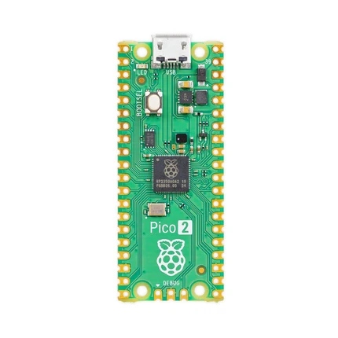
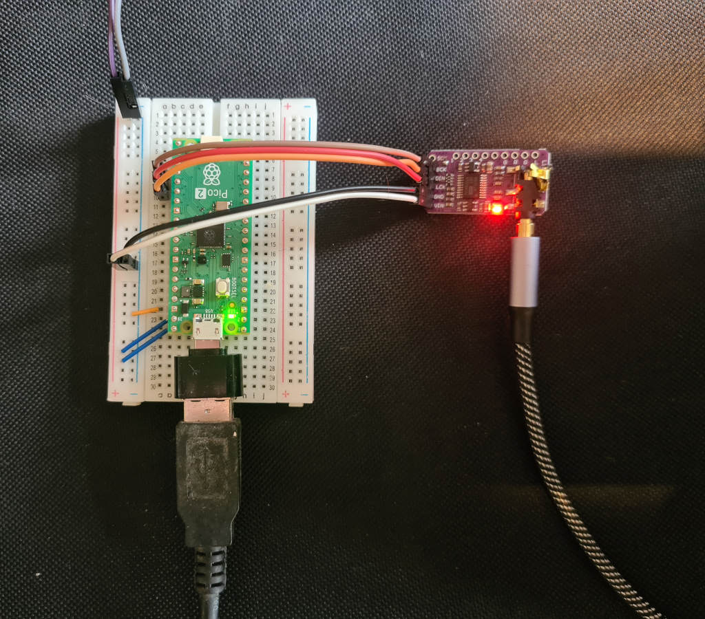
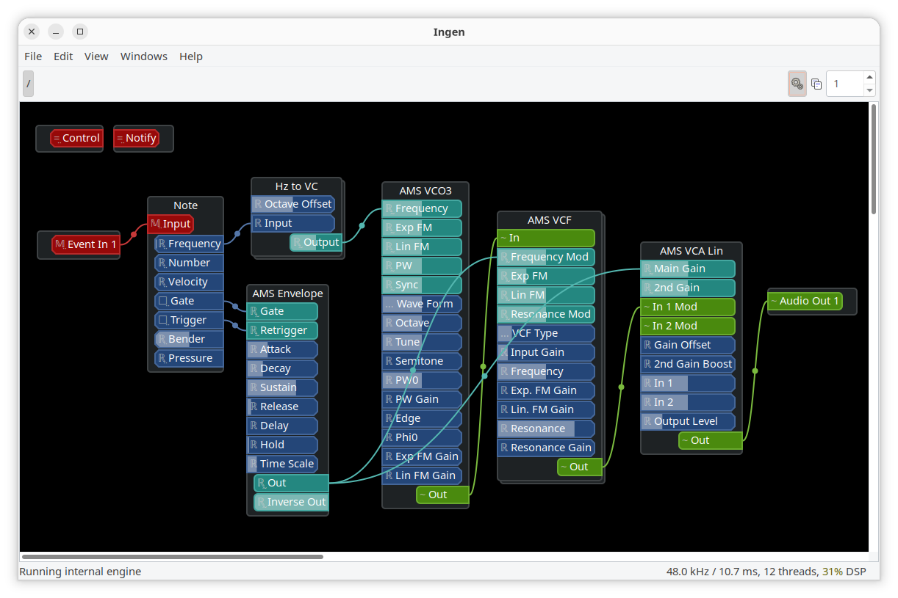

# PicoLV2

## LV2 plugins and Ingen patches on the Raspberry Pi Pico 2

My attempt to get audio plugins, and groups of audio plugins, working on the
Raspberry Pi Pico 2. The Pico host is written in Rust /
[Embassy](https://github.com/embassy-rs/embassy). I'm using
[LV2](https://lv2plug.in/) as the plugin format. Plugins can be written in
whatever, as long as they adhere to the
[LV2 standard](https://lv2plug.in/ns/lv2core). C, C++ and Rust are the obvious
options. Patches are in [ingen](https://gitlab.com/drobilla/ingen)'s bundle
format.

## Table of contents

- [The Pico 2](#the-pico-2)
- [Hardware wireup](#hardware-wireup)
- [LV2](#lv2)
- [Ingen](#ingen)
- [Project Status](#project-status)
- [Usage](#usage)
- [TODO](#todo)
- [Caveats and limitations](#caveats-and-limitations)
- [AI declaration](#ai-declaration)

## The Pico 2

The Raspberry Pi Pico 2 is a $5 microcontroller board, from the people who
brought you the $35 Raspberry Pi computer in 2012.

It runs (un-overclocked) at 150MHz. Which one the one hand is ~3000 cycles per
sample at 48KHz, which seems like enough to get some stuff done. On the other
hand it's a lot less than you get even on a "very slow" modern PC.

It has 2MB of Flash RAM and 520KB of SRAM. For anything realtime we have to use
the SRAM, so that's a bit of a limitation. Eg. a 2.5s mono audio buffer takes up
480KB on its own.

I guess there's a lot we won't be able to do, but also a lot we will. It's a $5
device, there will be compromises.

Note that I'm targeting the Pico 2, even if I just say "the Pico" for brevity.
The original Pico is limited in ways I think might make this a bit impractical,
eg. no hardware floats. Again, a Pico 2 costs $5.

## Hardware wireup

To get audio out of the Pico, I'm using a PCM5102 I2S DAC board. I should write
this up here properly but for now see
[this other project](https://github.com/Joeboy/oxynth) for details of how to
hook it up. Small amount of soldering involved.

There's currently no audio in, which frustratingly means it can't be used for
guitar effects or whatever. At some point I'll get around to hooking it up to an
ADC as well as the DAC.

I like the idea that one day it might run on something a bit more suitable, like
a beefier ARM board with integrated audio IO. I'm open to collab on this!

## LV2

I can't claim to be an expert on plugin formats, but [LV2](https://lv2plug.in/)
seems very open and extensible, and I kind of know it already.

There are lots of LV2 plugins out there. I'm hoping that at least some of the
simpler effects plugins might just work with minimal changes. So far the only
"real" plugin I've (kind of) ported is ams-lv2. There are some ad-hoc testing
plugins in the [plugins/](plugins) folder, which I'll probably remove later.

At this point it's uncertain how practical it'll be to port existing LV2
plugins. They're obviously intended for real computers and might be too heavy
for the Pico. If that's the case we get to write specialized PicoLV2 plugins.

There's also an open question - if I fork a plugin and make it work with
PicoLV2, should I use the same URID? It's _fundamentally_ the same plugin, but
typically URIDs are tied to domain names owned by their developers. Not yet sure
what the right answer is.

## Ingen

The "patch" format is Ingen.

I'm not 100% sure if that's the right choice. The format seems cool, but Ingen
itself is a bit painful to use. I don't have any better ideas.

In some cases a patch could just be a single LV2 plugin connected up to the
input and output. It could also (at least in theory) be a full-on modular synth
patch with lots of nodes.

## Project Status

It's still quite new but things seem to be working pretty well. You can hook up
LV2 plugins using Ingen and flash the graph to your Pico with the
[firmware](./picolv2-firmware/) to play / hear the result.

The next thing is to port more LV2 plugins for the Pico. There's currently just
the few toy ones under [./plugins/](plugins/), and my
[ams-lv2 port](https://github.com/Joeboy/ams-lv2/tree/picolv2-build).

## Usage

I need to redo the documentation a bit, for now the best place to look is the
[picolv2-image README](./picolv2-image).

## TODO

- Try porting more existing LV2 plugins. Hopefully some will work with minimal
  changes, we'll see.
- Provide some easy way to get a bunch of extant LV2 plugins from their home
  repos into a "central" location.
- Audio input to the Pico (both hardware and software parts). Synths are nice
  but being able to do effects is the real goal.
- At some point I'm going to have to figure out what to do about controls. Maybe
  eventually there will be hardware with knobs. Or for now we could wire it up
  to MIDI controller messages?
- Once we have controls, we should maybe have some way to save state to flash
  RAM. Should check out the LV2
  [state extension](https://lv2plug.in/ns/ext/state).
- At some point I should make there be downloadable binaries for the firmware,
  `picolv2-image` and the plugins. I guess Github actions.
- General testing. Lots of testing.
- More patches. Both modular synths and effects chains.

## Caveats and limitations

Before you get too excited:

- This is still at an early stage of development and there may be frustrations,
  particularly for beginners. Sorry about that.
- I'm currently assuming Linux, for the PC-side parts. It _might_ work on macOS
  or Windows if you have the dev toolchain setup. Somebody would have to try it
  and let me know. Obviously the pico binaries themselves don't care what OS
  your computer runs.
- The Pico 2 is puny compared to regular computers, so a lot of plugins probably
  won't run properly.
- Currently no audio in, and getting audio out requires some relatively easy
  soldering.
- Don't expect to be able to download and use regular LV2 plugins on the Pico.
  They need to be built specially for PicoLV2. As of now there's just the few
  plugins in this repo. Other plugins will require an amount of work to get
  working with PicoLV2. I haven't explored that much yet, I expect it to vary
  between trivial and basically impossible depending on the plugin. In
  particular anything that's not open source is in the "basically impossible"
  category.

## AI declaration

This project was assisted by AI tools (mostly github copilot with auto-models).
